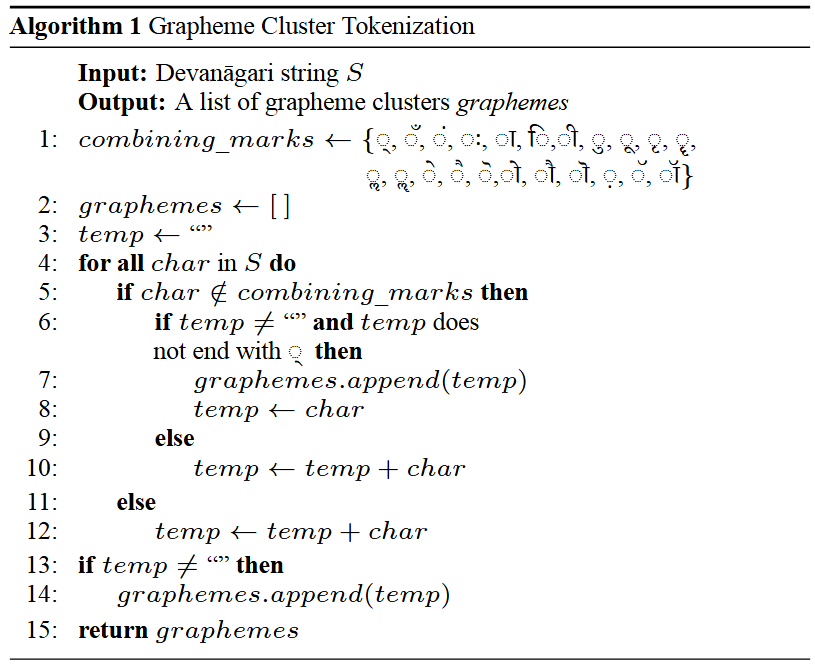
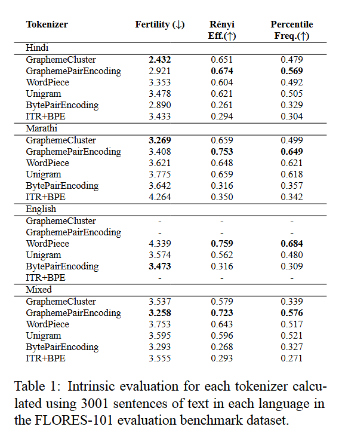
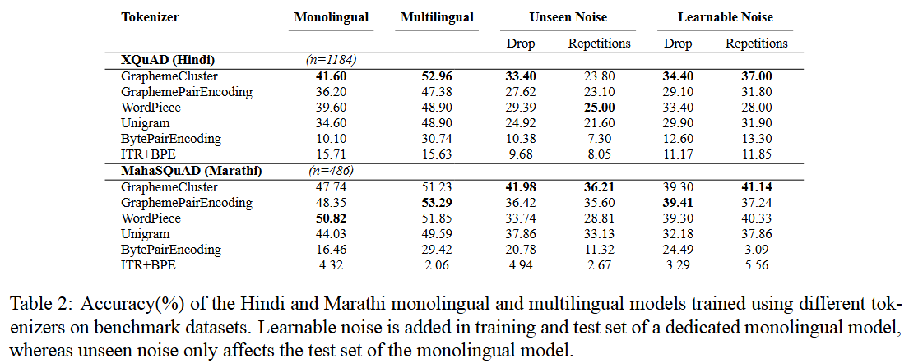
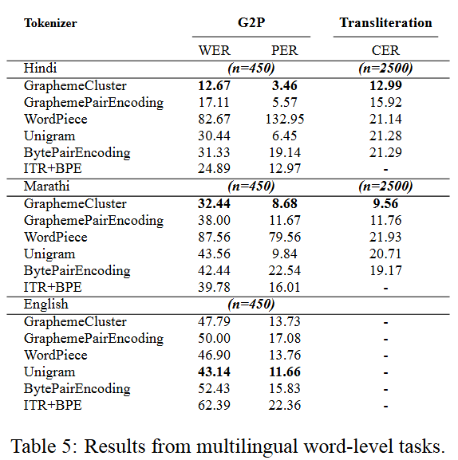

### **Comparative Analysis of the Intrinsic Metrics for Tokenizers and their effect on Downstream Tasks for Hindi and Marathi**

[Shagun Dwivedi](https://shagundwivedi.github.io) · [Kaushik Gopalan](https://www.linkedin.com/in/kaushik-gopalan-b6533624/?originalSubdomain=in)  
The 64th Annual Meeting of the Association for Computational Linguistics, 2026

[Paper]("https://aclanthology.org/2026.acl-long.1037/")

### Introduction

In this paper, we compare the performance of five existing tokenizers that use UTF-8 inputs, and we study how, *ceteris paribus*, different tokenization schemes affect the ability of language models for question-answering, transliteration, grapheme-to-phoneme conversion, and their robustness to noise. We also propose a novel grapheme cluster tokenizer, a form of visual character unit level tokenizer for *Devanagari*. We assess whether the performance of tokenizers on intrinsic evaluation metrics translates to the downstream performance of models trained using those tokenizers.

### Repo Structure

- `auto_eval/` contains code for the automated evaluation framework for the question answering tasks
- `eval/` contains code for model inference for QA, and inference + evaluation for word level tasks
- `train_llm/` contains code for training T5 for QA tasks and the word-level tasks
- `training_tokenizers/` contains code for training and implementation of all tokenizers used in the study.

<!-- ### Methodology

We assess the performance of six different tokenizers: Byte Pair Encoding (BPE), Unigram, WordPiece, grapheme cluster tokenizer, Grapheme Pair Encoding(GPE), and Byte Pair Encoding with transliteration during the pretokenization step (ITR+BPE).



The tokenizers are assessed using information-theoretic intrinsic evaluation metrics, as well as through the extrinsic evaluation of the performance of a language model pre-trained using different tokenizers. The investigation of correlation between the intrinsic and extrinsic metrics is also reported.

- Intrinsic Evaluation
    - Renyi Efficiency
    - Fertility
    - Percentile Frequency
- Extrinsic Evaluation
    - Generation Task:
        - QA - Accuracy
        - Noise Robust QA - Accuracy
    - Word-Level Tasks
        - G2P - PER, WER
        - Transliteration - CER


### Results





 -->

### Citation
```
@inproceedings{dwivedi-gopalan-2026-comparative,
    title = "Comparative Analysis of the Intrinsic Metrics for Tokenizers and their effect on Downstream Tasks for {H}indi and {M}arathi",
    author = "Dwivedi, Shagun  and
      Gopalan, Kaushik",
    editor = "Liakata, Maria  and
      Moreira, Viviane P.  and
      Zhang, Jiajun  and
      Jurgens, David",
    booktitle = "Proceedings of the 64th Annual Meeting of the {A}ssociation for {C}omputational {L}inguistics (Volume 1: Long Papers)",
    month = jul,
    year = "2026",
    address = "San Diego, California, United States",
    publisher = "Association for Computational Linguistics",
    url = "https://aclanthology.org/2026.acl-long.1037/",
    doi = "10.18653/v1/2026.acl-long.1037",
    pages = "22652--22663",
    ISBN = "979-8-89176-390-6"
}
```